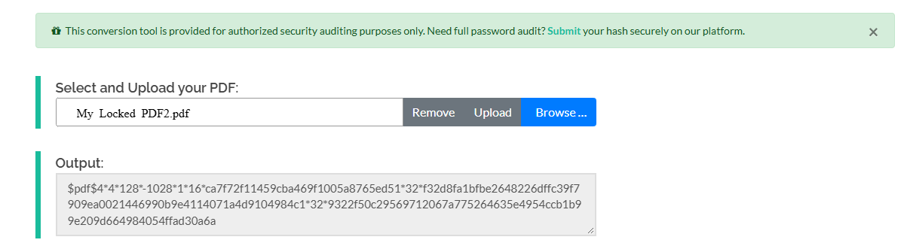
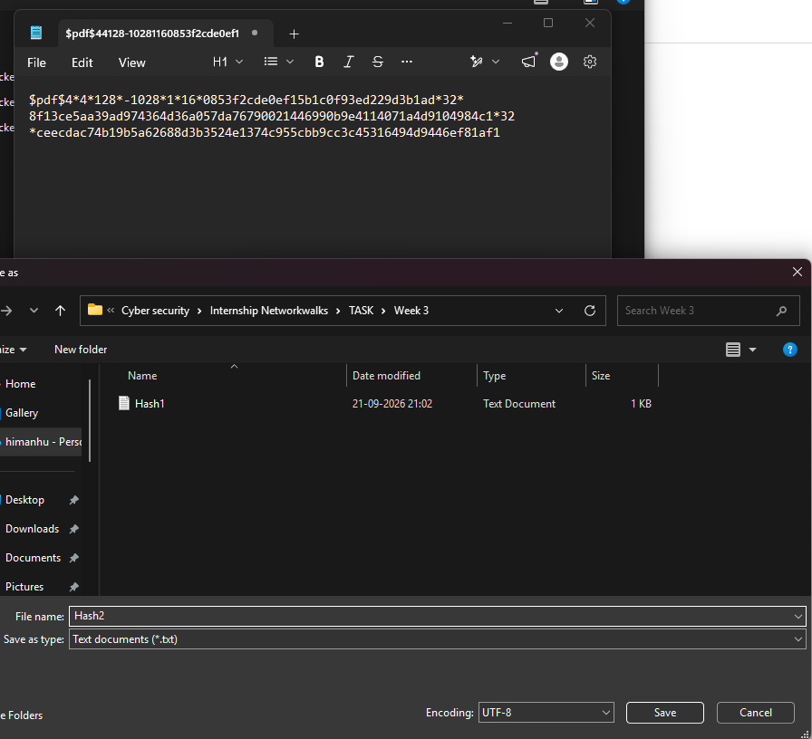
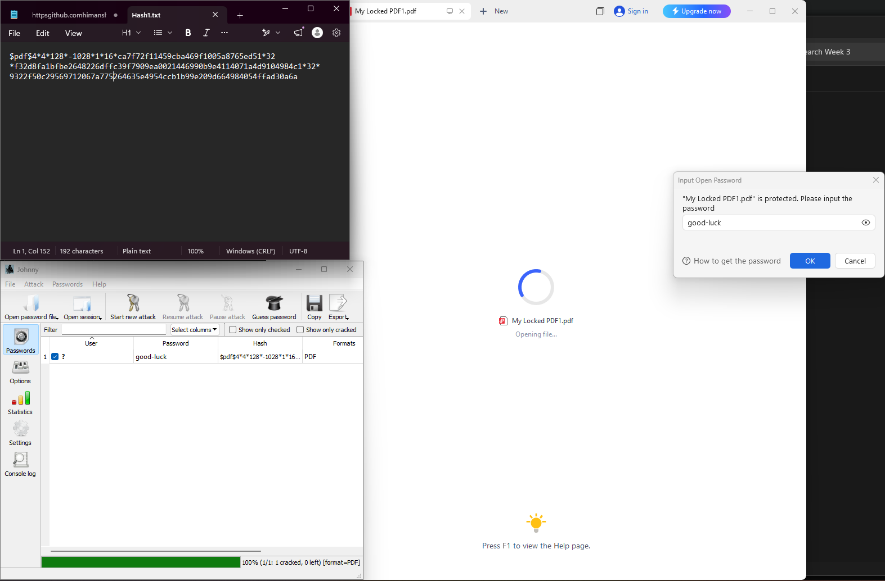
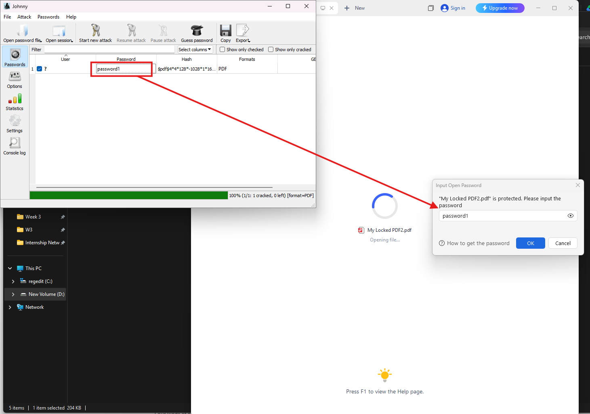
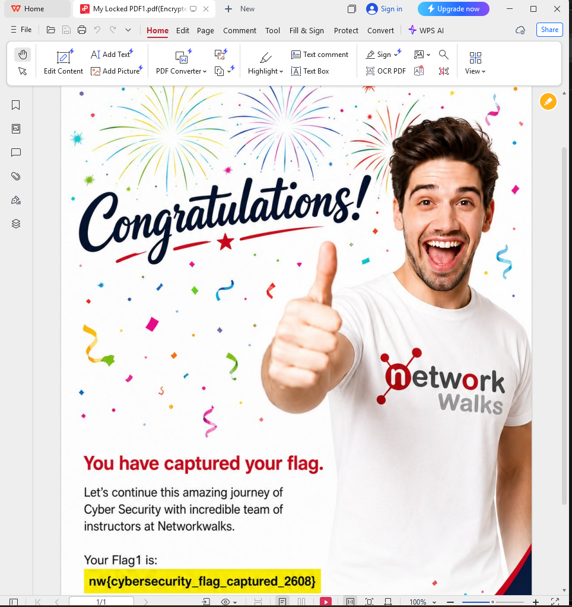
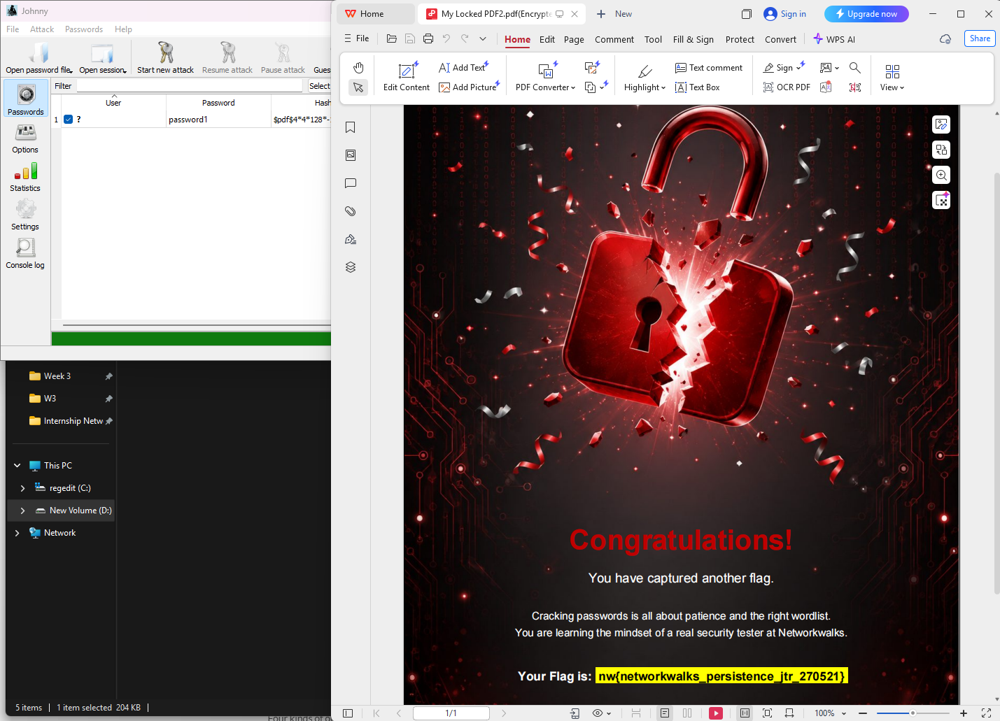
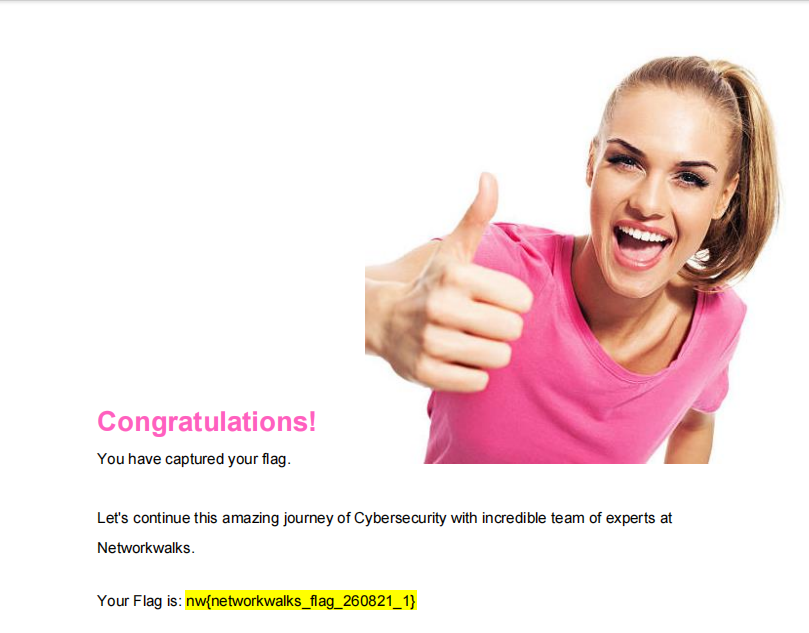

# PENETRATION TESTING & PASSWORD CRACKING REPORT

### PDF Password Auditing & Hash Cracking with John the Ripper[JTR] & Johnny GUI 
**W3-PM-FINAL | CYBERSECURITY INTERNSHIP | LAB REPORT**

| Field | Detail |
| :--- | :--- |
| **Pentester Name (Cybersecurity Professional)** | Himanshu Maikhuri |
| **Program/Batch** | B083-Networkwalks |
| **Date** | 21 September 2026 |
| **Modules completed** | W3-PM1: PDF Hash Extraction via OnlineHashCrack , W3-PM2: Password Auditing via JTR_Johnny GUI (Win x64) , W3-PM3: Encrypted File Unlocking & CTF Flag Capture |

| **Client/Target** | 1. Networkwalks CTF Lab Targets (My Locked PDF1.pdf, My Locked PDF2.pdf) |
| **Permission secured from client?** | Yes (Authorized Internship CTF Environment)|
| **Phases covered** | Hash Extraction, Offline Cryptographic Auditing & Document Unlocking |

---

## 1. Introduction

This report details the practical security auditing performed during Week 3 of my Cybersecurity Internship at Networkwalks. The goal was to audit encrypted PDF documents (My Locked PDF1.pdf and My Locked PDF2.pdf), extract their cryptographic hash signatures, perform an offline dictionary attack using John the Ripper (CLI Win x64) via the Johnny GUI interface on Windows, and recover embedded CTF flags.

The workflow demonstrates how attackers extract password hashes from application files and execute dictionary attacks to uncover weak document passwords, highlighting the necessity of strong passphrases and modern PDF encryption standards.

---

## 2. Tools Used

The table below lists each tool used in this report and its purpose:

| Tool | Purpose |
| :--- | :--- |
| **Windows 11 (x64)** | Operating system environment hosting the attack tools and analysis utilities. |
| **OnlineHashCrack (PDF Hash Extractor)** | Web utility used to parse encrypted PDF structures and extract the raw $pdf$4* hash signature. |
| **JTR_John CLI (Win x64)** | Core backend cryptographic cracking engine. |
| **JTR_Johnny GUI (Win x64)** | Graphical frontend interface for John the Ripper used to manage sessions and run dictionary attacks. |
| **Notepad / Text Editor** | Used to clean, format, and save extracted hashes (Hash1.txt, Hash2.txt). |

---

## 3. Activities Performed

### 3.1 PDF Hash Extraction

Because direct PDF files cannot be fed directly into standard hash cracking algorithms without parsing, the document structure must first be converted into a compatible cryptographic hash signature.

1. Uploaded My Locked PDF2.pdf to the OnlineHashCrack PDF Hash Extractor utility ([https://www.onlinehashcrack.com/tools-pdf-hash-extractor.php](https://www.onlinehashcrack.com/tools-pdf-hash-extractor.php)).

2. Successfully extracted the raw PDF hash format:
$pdf$4*4*128*-1028*1*16*ca7f72f11459cba469f1005a8765ed51*32*f32d8fa1bfbe2648226dffc39f7909ea0021446990b9e4114071a4d9104984c1*32*9322f50c29569712067a775264635e4954ccb1b9e209d664984054ffad30a6a

3. Copied and saved the output hash into Hash2.txt inside the project folder (TASK\Week 3).

4. Repeated the extraction process for My Locked PDF1.pdf and saved its corresponding output as Hash1.txt.

### 3.2 Password Auditing with Johnny GUI & JTR (Win x64)

With the hash files generated, the Johnny GUI (Windows x64 edition) was launched to manage the backend John the Ripper engine.

1. Opened Hash2.txt inside Johnny GUI.

2. Johnny automatically recognized the hash format as PDF.

3. Initiated a dictionary attack session (Start new attack) against Hash2.txt.

4. Johnny successfully recovered the plaintext password in under a second:
   >Target File: My Locked PDF2.pdf
   >Recovered Password: password1

5. Loaded Hash1.txt into Johnny GUI and executed the attack:
   >Target File: My Locked PDF1.pdf
   >Recovered Password: good-luck

### 3.3 Document Unlocking & CTF Flag Verification

To verify the success of the cracking process, the recovered credentials were used to open the encrypted PDF files in WPS Office.

1. Opened My Locked PDF2.pdf, entered password1, and verified the unlocked document.

2. Opened My Locked PDF1.pdf, entered good-luck, and verified the unlocked document.

3. Successfully captured and recorded all required lab flags:
Flag 1: nw{cybersecurity_flag_captured_2608}
Flag 2: nw{networkwalks_persistence_jtr_270521}
Flag 3: nw{networkwalks_flag_260821_1}

---

## 4. Risk Analysis / Impact

| # | Finding / Observation | Evidence / Technical Detail | Potential Impact | Risk Level |
| :-: | :--- | :--- | :--- | :-: |
| **1** | Weak Passwords on Sensitive Documents| password1 was cracked instantly via dictionary attack using JTR/Johnny. | Unauthorized individuals can gain immediate access to confidential corporate files.|🔴 Critical |
| **2** | Predictable Passphrase Choices | good-luck was recovered within a short wordlist evaluation cycle. | Leaves document protection vulnerable to basic automated spraying and wordlist attacks. | 🟡 Medium |
| **3** | Public Hash Extraction Risk | PDF hash headers can be extracted without knowing the document password. | Attackers can perform offline brute-force attacks without triggering access logs or lockouts. | 🟡 Medium |

> **Risk Level Key:** 🔴 Critical | 🟡 Medium | 🟢 Low

---

## 5. Recommendations

* **Implement High-Entropy Passphrases: Protect sensitive PDF archives with passphrases containing at least 16+ characters, combining upper/lowercase letters, numbers, and symbols.
* **Upgrade PDF Encryption Standards: Enforce AES 256-bit encryption (Acrobat X and later) across all enterprise document generation tools to increase key derivation costs.
* **Avoid Reusing Common Dictionary Words: Restrict document passwords from containing default or simple terms like password1, welcome, or common greetings.
* **Use Enterprise DRM for Sensitive Files: For highly confidential documents, rely on Rights Management Services (RMS) with centralized authentication rather than static password protection alone.

---

## 6. Conclusion

During Week 3 of my Cybersecurity Internship at Networkwalks, I successfully performed end-to-end password auditing on encrypted PDF files in a Windows environment using OnlineHashCrack, JTR CLI, and Johnny GUI.

This practical exercise demonstrated that static document encryption is only as strong as the underlying password. Weak passphrases can be audited and cracked offline in seconds once the hash header is extracted, reinforcing the critical need for robust password hygiene and modern encryption standards across organizations.

---

## 7. Evidences Collected

Screenshots collected as evidence during the activities are stored in the `/screenshots` directory:

* 
* 
* 
* 
* 
* 
* 

---
*- End of Report -*
